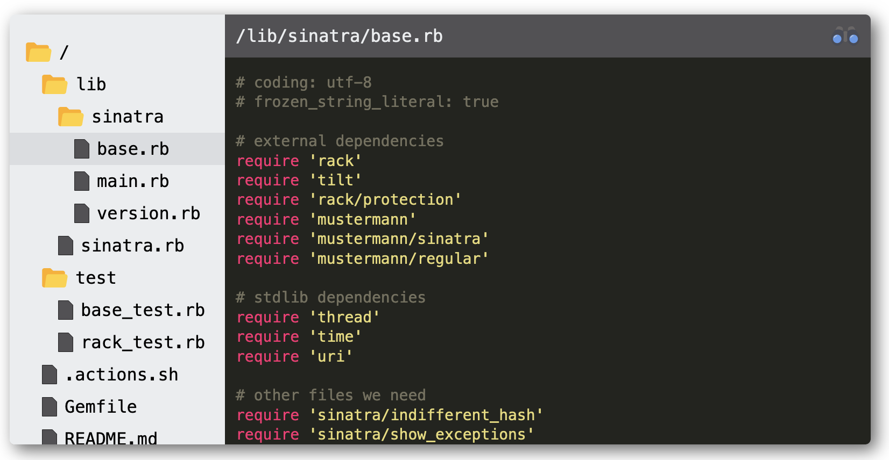

<div align="center">
  <h1>vanilla-tree-viewer</h1>

  <a href="https://github.com/abhchand/vanilla-tree-viewer">
    
  </a>

  <p>VanillaTreeViewer is a minimalist file browser for compactly displaying several files at once</p>
</div>

---

[![Build Status][ci-badge]][ci] [![NPM Version][npm-version-badge]][npm-version] [![MIT License][license-badge]][license] [![PRs Welcome][prs-badge]][prs]

[![Watch on GitHub][github-watch-badge]][github-watch]
[![Star on GitHub][github-star-badge]][github-star]
[![Tweet][twitter-badge]][twitter]

Perfect for blog posts ([like this one](https://abhchand.me/blog/use-react-in-rails-without-the-react-rails-gem)), tutorials, documentation, etc...

\[[view demo](https://abhchand.me/vanilla-tree-viewer)\] | \[[view codepen playground](https://codepen.io/abhchand/pen/WNZGQpQ)\] | \[[view this project on npm](https://www.npmjs.com/package/vanilla-tree-viewer)\]



*The above displays a sample of files from the* [`sinatra`](https://github.com/sinatra/sinatra/) *project*

# Table of Contents

- [Install](#install)
- [Usage](#usgae)
- [Syntax Highlighting](#syntax-highlighting)
  - [Default Language Support](#default-language-support)
  - [Other Language Support](#other-language-support)
- [Options](#options)
- [Customization](#customization)
  - [Configuring Width and Alignment](#configuring-width-and-alignment)
  - [Customizing Styling](#customizing-styling)
- [Development](#development)
- [Building Releases](#building-releases)
- [Issues / Contributing](#issues-contributing)
- [Changelog](#changelog)

# <a name="install"></a>Install

Import the latest **script** and **styling** ([See all versions](https://cdn.jsdelivr.net/gh/abhchand/vanilla-tree-viewer@master/dist/))

```html
<head>
  <!-- Note the `onload` call within the `<script>` tag. -->
  <script type="text/javascript" onload="VanillaTreeViewer.renderAll()" src="https://cdn.jsdelivr.net/gh/abhchand/vanilla-tree-viewer@2.1.0/dist/index.min.js"></script>

  <link rel="stylesheet" href="https://cdn.jsdelivr.net/gh/abhchand/vanilla-tree-viewer@2.1.0/dist/main.min.css">
</head>
```

# <a name="usage"></a>Usage

At minimum, you will need to specify the _path_ and _contents_ for all files as an HTML list (`<ol>`). You **must** include the `.vtv` CSS class.

Additional behavior can be defined using `data-*` attributes. For a full list of `data-*` attributes, see [Options](#options).

```html
<ol class='vtv' data-language="javascript">
  <!-- File 1 -->
  <!-- File contents will be fetched from the `data-url` -->
  <li
    data-path="lib/axios.js"
    data-url="https://raw.githubusercontent.com/axios/axios/master/lib/axios.js">
  </li>

  <!-- File 2 -->
  <!-- Alternately, you can directly specify the file contents inline `<li>...</li>` -->
  <!-- You can also override syntax highlighting with `data-language` for this file -->
  <li data-path="values.json" data-language="json">{ "foo": "bar" }</li>

  <!-- File 3 -->
  ...
</ol>
```

💡 To run this example locally, clone this project and open [`examples/quick_start.html`](examples/quick_start.html).

▶️ To run this example on codepen, [click here](https://codepen.io/abhchand/pen/WNZGQpQ)

# <a name="syntax-highlighting"></a>Syntax Highlighting

`VanillaTreeViewer` uses the wonderful [highlight.js](https://highlightjs.org/) library for syntax highlighting.

See the [full list of language syntax definitions](https://cdnjs.com/libraries/highlight.js/11.3.1) supported by `highlight.js`.

## <a name="default-language-support"></a>Default Language Support

To keep the bundle size small, `VanillaTreeViewer` supports syntax highlighting for only the most common languages by default.

If you're highlighting files in any of these languages, there's no further action required.

> `bash`, `c`, `cpp`, `csharp`, `css`, `diff`, `go`, `java`, `javascript`, `json`, `makefile`, `xml`, `markdown`, `objectivec`, `php`, `php-template`, `plaintext`, `python`, `ruby`, `rust`, `scss`, `shell`, `sql`, `typescript`, `yaml`

## <a name="other-language-support"></a>Other Language Support

If you require syntax highlighting for any language not supported by default, you'll have to manually include the syntax definitions from `Highlight.js`. Don't worry, it's easy!

1. Find your language's syntax definitions from the [available list of language syntax definitions supported by `highlight.js`](https://cdnjs.com/libraries/highlight.js/11.3.1).
2. Then, add the `<script>` for your syntax definitions _after_ the `VanillaTreeViewer` `<script>`.

For example, to highlight `ActionScript` include the second `<script>` definition below:

```html
<script type="text/javascript" onload="VanillaTreeViewer.renderAll()" src="https://cdn.jsdelivr.net/gh/abhchand/vanilla-tree-viewer@2.1.0/dist/index.min.js"></script>

<!-- Add this: -->
<script type="text/javascript" src="https://cdnjs.cloudflare.com/ajax/libs/highlight.js/11.3.1/languages/actionscript.min.js"></script>
```

# <a name="options"></a>Options

`VanillaTreeViewer` uses HTML attributes on the _parent_ (`<ol>`) and _child_ (`<li>`) nodes to configure behavior.

```html
<!-- Parent node -->
<ol class="vtv">
  <!-- Child node -->
  <li data-path="src/index.js">
    <!-- File contents -->
  </li>
</ol>
```

The following attribute options are available:

| Attribute  | Type | Applies to | Required? | Default | Description
| ------------- | ------------- | ------------- | ------------- | ------------- | ------------- |
| `class` | `String` | parent node only | **Yes** | n/a | The class name `.vtv` **must** exist on each parent node. Optionally, if you specify any other custom classes they will also be preserved.
| `data-path`  | `String` | child node only | **Yes** | n/a | The path under which the file should be displayed in the viewer tree |
| `data-url`  | `String` | child node only | **Yes\*** (one of the following must be present: inline file contents (`<li>...</li>`) or `data-url`) | `null` | The URL to fetch the file contents from (e.g. Github Raw URLs). Any inline file contents specified between `<li>...</li>` will always take precedence over `data-url`.|
| `id` | `String` | parent node only | No | auto-generated | Each `VanillaTreeViewer` instance is automatically assigned a unique, sequential `id` (`vtv--1`, `vtv--2`, etc...). However, if you explicitly specify an `id` it will be preserved and used instead of the auto-generated value.
| `data-selected` | `Boolean` | child node only | No | `false` | Indicates whether this file should be selected when the viewer loads. If more than one file is marked `data-selected="true"`, the first one is chosen. Similarly, if no file is marked `data-selected="true"`, the first file in the list will be selected by default.
| `data-language` | `String` | child or parent node | No | `null` | The `highlight.js` language to use for syntax highlighting. [See a full list of supported languages](https://github.com/highlightjs/highlight.js/tree/master/src/languages).
| `data-style` | `String` | child or parent node | No | `'monokai-sublime'` | The `highlight.js` style (color theme) to use for syntax highlighting. [See a full list of supported styles](https://github.com/highlightjs/highlight.js/tree/master/src/styles). (**NOTE**: The [`highlight.js` demo page](https://highlightjs.org/static/demo/) will let you preview various languages and styles.)


For attributes that can be specified on the "child or parent node", the child attribute (`<li>`) takes precedence.

# <a name="customization"></a>Customization

### <a name="configuring-width-and-alignment"></a>Configuring Width and Alignment

All `VanillaTreeViewer` instances are wrapped in a `<div class="vtv-wrapper">` element. It is recommended that you style this wrapper element accordingly to set the desired width and alignment.

For example:

```html
<style>
  .vtv-wrapper {
    margin: auto;
    max-width: 980px;
  }
</style>
```

### <a name="customizing-styling"></a>Customizing Styling

The default styling for `VanillaTreeViewer` is based off the look and feel of [Sublime Text](https://www.sublimetext.com/). While you can change the `style`/theme for any specific file(s), `VanillaTreeViewer` does not provide a programmatic way to customize the component itself.

However, you are free to customize the look and feel as needed by overriding [the CSS](https://cdn.jsdelivr.net/gh/abhchand/vanilla-tree-viewer@2.1.0/dist/main.min.css) at your discretion.

* All top-level CSS classes begin with `.vtv*`
* Please be aware that the default styling utilizes [media queries](https://www.w3schools.com/css/css_rwd_mediaqueries.asp) to apply styling at different screen widths.

💡 TIP: if you want to give the component a nice drop shadow to make it stand out on light backgrounds, try:

```css
.vtv-root {
  box-shadow: 5px 5px 15px 0 rgba(50,50,50,.75);
}
```

# <a name="development"></a>Development

See the guide to [`DEVELOPING`](guides/DEVELOPING.md).

# <a name="building-releases"></a>Building Releases

See the guide to [`RELEASING`](guides/RELEASING.md).

# <a name="issues-contributing"></a>Issues / Contributing

See the guide to [`CONTRIBUTING`](guides/CONTRIBUTING.md).

# <a name="changelog"></a>Changelog

See [release notes](https://github.com/abhchand/vanilla-tree-viewer/releases)

[ci-badge]:
  https://circleci.com/gh/abhchand/vanilla-tree-viewer/tree/master.svg?style=svg
[ci]:
  https://circleci.com/gh/abhchand/vanilla-tree-viewer/tree/master
[npm-version-badge]:
  https://img.shields.io/npm/v/vanilla-tree-viewer.svg?style=flat-square
[npm-version]:
  https://www.npmjs.com/package/vanilla-tree-viewer
[license-badge]:
  https://img.shields.io/npm/l/vanilla-tree-viewer.svg?style=flat-square
[license]:
  https://github.com/abhchand/vanilla-tree-viewer/blob/master/LICENSE
[prs-badge]:
  https://img.shields.io/badge/PRs-welcome-brightgreen.svg?style=flat-square
[prs]: http://makeapullrequest.com
[github-watch-badge]:
  https://img.shields.io/github/watchers/abhchand/vanilla-tree-viewer.svg?style=social
[github-watch]: https://github.com/abhchand/vanilla-tree-viewer/watchers
[github-star-badge]:
  https://img.shields.io/github/stars/abhchand/vanilla-tree-viewer.svg?style=social
[github-star]: https://github.com/abhchand/vanilla-tree-viewer/stargazers
[twitter]:
  https://twitter.com/intent/tweet?text=Check%20out%20vanilla-tree-viewer%20by%20%40YeaaaahBoiiii%20https%3A%2F%2Fgithub.com%2Fabhchand%2Fvanilla-tree-viewer%20%F0%9F%91%8D
[twitter-badge]:
  https://img.shields.io/twitter/url/https/github.com/abhchand/vanilla-tree-viewer.svg?style=social
